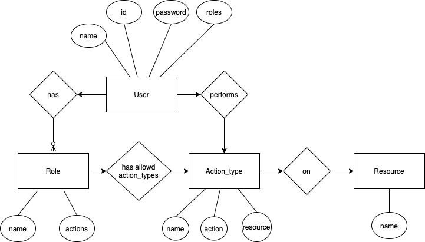

# Bluestacks Interview Assignment

## Introduction

This is a RBAC (Role Based Access Control) system simulator.

## Requirements

Needs Node. Tested on 12.16.1 .Install from [here](https://nodejs.org/en/download/)

## Files

Following files and folders are majorly used

| Name                  | Description                                                   |
| --------------------- | ------------------------------------------------------------- |
| index.ts              | Entrypoint , handles the main execution                       |
| models                | This Folder contains the models as per the architecture       |
| database/db.ts        | contains all data and initialized values                      |
| constants/constant.ts | contains constants for the project eg ACCESS_LEVEL            |
| controller/Prompt.ts  | contains the logic to render the cli menus and get user input |

## Demo Data

The system is init with:

- Admin User with access to all resources with all action types.

- 4 Users _Reader, Writer, Creator, Remover_ with _Read, Write , Create , Delete_ actions on all resources respectively

- 4 roles as _creator, reader, updater and remover_ . They can do the respective action on all the resources.

- All actions for all resources are initialized in a object

- 3 sample resources

- Default **Password** of all users and Admin is **hello**

## Installation

```sh
git clone git@github.com:vipulsharma144/interview-assignment.git
cd interview-assignment
npm install
```

## Executing

In the _interview-assignment_ folder execute

```sh
npm start
```

## files

## Assumptions

- Roles and Resources are initialized and need not be modified in the program in run time.

- The password is store in simple raw text but can be hashed using library like bcrypt.

- resources can be any resource such as a server or webpage

- By Default access to all resource is denied until explicitly allowed via role

- Only admin can create users and assign/unassign roles

- Name of Role, action_type and resource has to be **unique** .

## Demo


## Architecture



## Contact

In case of any issue please contact vipulsharma144@gmail.com
